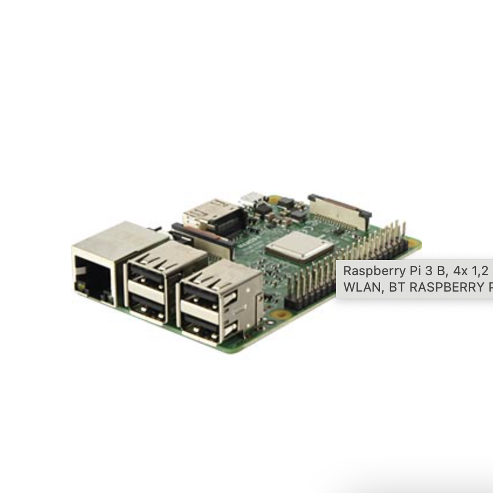
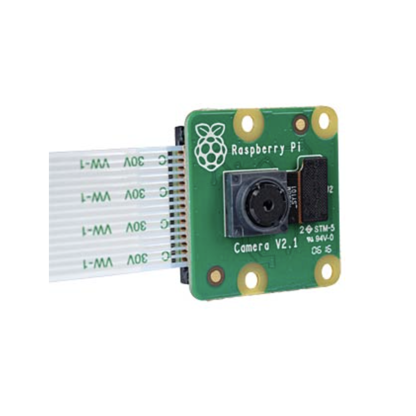
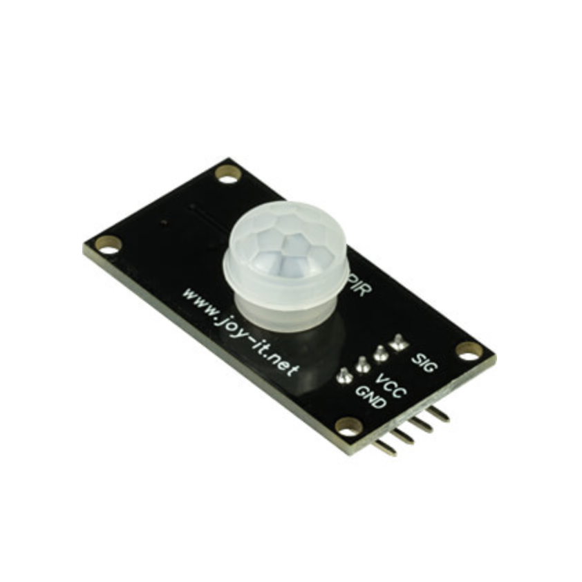
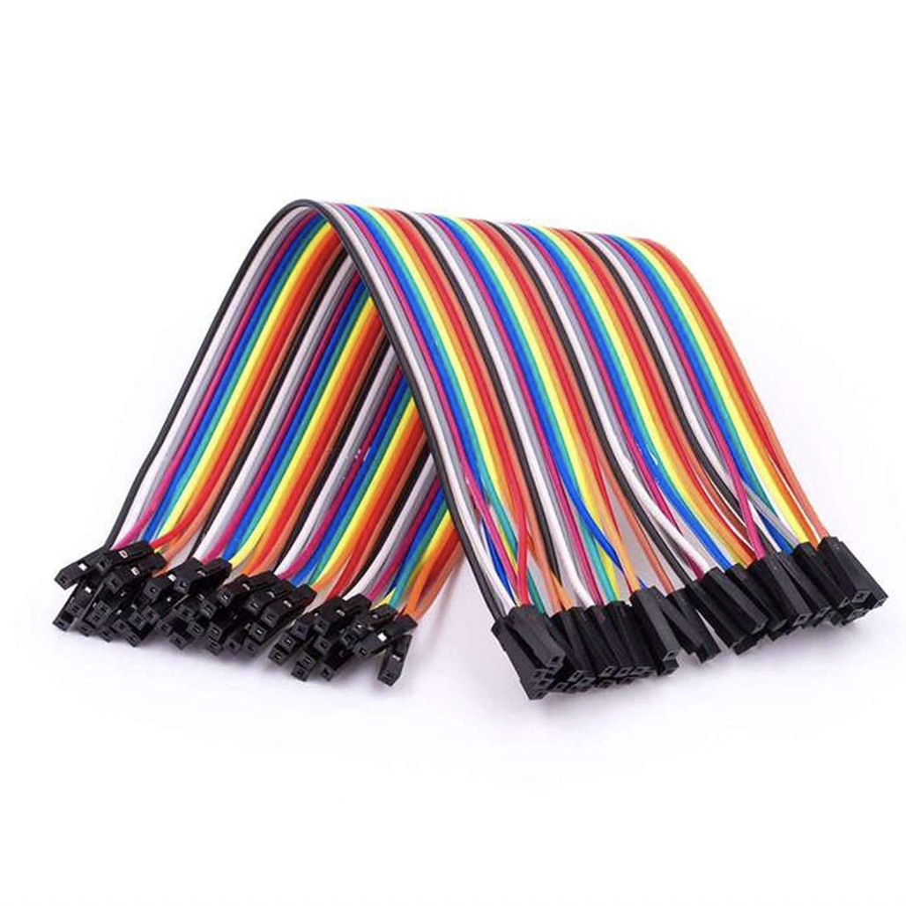

#BirdsOnBikes

# Anleitung

## Die Komponenten

### RaspberryPi 3


### Raspberry Kamera V.2


### PIR Sensor (Bewegungssensor)


### 3x Kabel Weiblich/ Weiblich


## Zusammenbauen der Komponenten

    1. Den Gehäusedecke des Raspberry Pi´s abnehmen. 

    2. Das Kabel des Kamermoduls in den Beschrifteten Kamera Eingang stecken.
    (Hier auf die Richtung der Kontakte achten)

    3. Drei Kabel an die Pins (GND, VCC, SIG) des PIR Sensors anschließen. 

    4. Die Kabel müssen nun jeweils richtig an die Pins des Raspberry Pi´s angeschlossen werden. 
    GND = 6 / VCC = 4 / SIG = 16


## Wifi verbindung herstellen

    1. Den Raspberry Pi ausschalten (Stromkabel entfernen)

    2. Die SD Karte auf der Rückseite herausnehmen und in deinen Rechner einlegen

    3. Einen beliebigen Text Editor öffen (NotdePad, VS Code)

    4. Die SD Karte auswählen auf dem Ordner Boot eine neue Datei mit dem Namen: wpa_supplicant.conf anlegen

    5. Folgenden Text in die Datei kopieren:

```bash ctrl_interface=DIR=/var/run/wpa_supplicant GROUP=netdev
country=de
update_config=1
network={
    ssid="<Name of your wireless LAN>"
    psk="<Password for your wireless LAN>"
}
```
    6. <Name of your wirless LAN> und <Password for your wireless LAN> ersetzen.

    7. Die Datei abspeichern und die SD Karte auswerfen.

    8. Die SD Karte wieder in den Raspberry Pi einlegen.

    9. Nach 5 minuten sollte sich der Raspberry Pi mit dem Internet verbunden haben
    (Um das zu überprüfen kann man per SSH auf den Raspberry Pi gehen)
    Dafür die Bash öffnen und: 

``` bash 
ssh <name des raspberry pi´s> eingeben 
```
    Namen sind in unserem Fall: 
    (pi@campi1) oder (pi@campi3)
    Das Passwort ist (birdie)

    Wenn alles richtig gelaufen ist sollte man jetzt mit SSH auf dem Raspberry Pi sein. 
